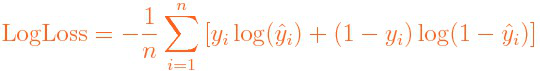
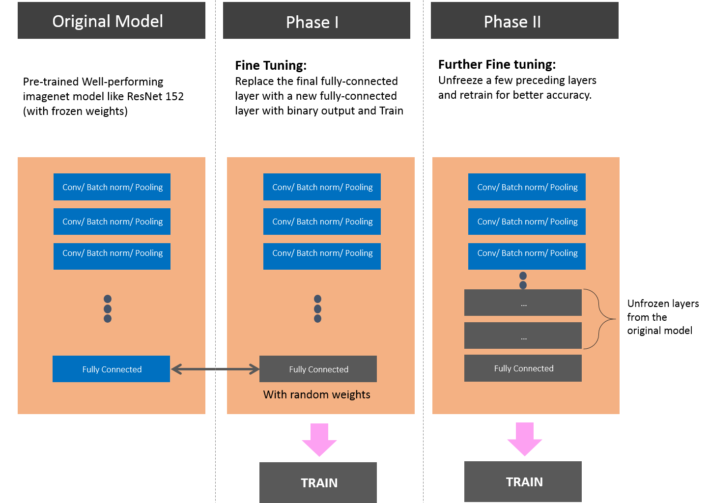

# Tackling **Cats vs Dogs** kaggle challenge using **transfer-learning** and pytorch

 

## Introduction

 

 

[The challenge](https://www.kaggle.com/c/dogs-vs-cats-redux-kernels-edition) provides a dataset of

 

-  12,500 Cat photos

-  12,500 Dog photos

 

and then asks us to predict the category of 12,500 test images (Cat or Dog). The submission is evaluated based on log loss (smaller is better):

 

## Approach

 

As shown in the figure below, my approach will be as follows:

 

1.  Use a pretrained imagenet model (e.g. resnet-152)

2.  Replace the last fully-connected layer with a new one with binary output, while freezing the rest of the layers and train on the given image dataset.

3.  Unfreeze a few preceding layers and retrain for further fine-tuning.

 

As in some other projects, I'll use [ **Pytorch** ](pytorch.org), which I am increasingly a fan of.

 
